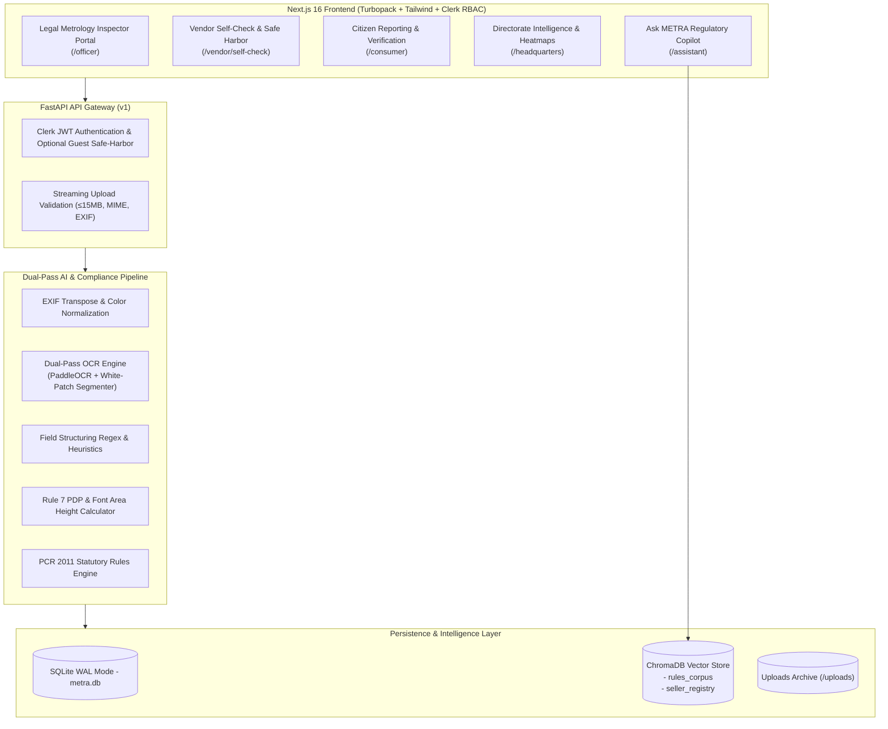

<div align="center">

# ⚖️ METRA
### **Metrology Enforcement & Traceability Regulatory Assistant**
*AI-Powered Statutory Packaging Verification, Automated Compliance Matrix & Regulatory Intelligence*

[](https://nextjs.org/)
[](https://reactjs.org/)
[](https://fastapi.tiangolo.com/)
[](https://python.org/)
[](https://typescriptlang.org/)
[](https://tailwindcss.com/)
[](https://www.trychroma.com/)
[](#)

<p align="center">
  <b>Enforcing the Legal Metrology (Packaged Commodities) Rules, 2011 & Legal Metrology Act, 2009 with Computer Vision, Vector RAG, and Role-Based Regulatory Governance.</b>
</p>

[Key Features](#-key-features) •
[Architecture](#-system-architecture) •
[Compliance Engine](#-dual-pass-ai--computer-vision-engine) •
[Role Portals](#-role-based-ecosystem) •
[Statutory Matrix](#-statutory-rules-coverage-pcr-2011) •
[Quickstart](#-quickstart--local-development)

---

</div>

## 📌 Executive Summary

Under the **Legal Metrology (Packaged Commodities) Rules, 2011 (PCR 2011)** and the **Legal Metrology Act, 2009**, every pre-packaged commodity manufactured, packed, imported, or sold in India must strictly display mandatory statutory declarations (such as Manufacturer Details, Net Quantity, Maximum Retail Price inclusive of all taxes, Month & Year of Packaging, and Consumer Care contacts). 

Manual field inspections are resource-intensive, slow, and prone to oversight. **METRA** solves this through an end-to-end, automated AI and Computer Vision pipeline designed for:
1. **Field Legal Metrology Officers:** Instant label audits, bounding-box declaration tracking, automatic compounding penalty calculations, and digital evidence case logging.
2. **Manufacturers & Packers (Vendors):** Pre-Market Artwork Self-Check with statutory safe harbor, identifying non-compliant fonts or missing declarations prior to commercial printing.
3. **Consumers & Citizens:** Fast QR/label checks, crowd-sourced violation reporting, and consumer rights awareness.
4. **Central Directorate & HQ:** Macro compliance heatmaps, repeat-offender brand tracking, and enforcement analytics.

---

## 🚀 Key Features

- **🔍 Dual-Pass Deep OCR & Segmentation:**
  - Specialized pipeline combining orientation-corrected PaddleOCR with **white-patch statutory mask isolation**.
  - Recovers dot-matrix stamped MRPs, packaging dates, and batch codes from low-contrast thermal printing and white label overlays.
- **📐 Interactive Bounding-Box Detection Map:**
  - Projects color-coded statutory bounding boxes (`COMPLIANT` in emerald, `NON_COMPLIANT` in amber/red) directly over uploaded packaging artwork.
  - Hover synchronization between visual package highlights and the statutory rules card matrix.
- **📏 Rule 7 Font Size & PDP Legibility Analyzer:**
  - Calculates Principal Display Panel (PDP) area (in cm²) and cross-references statutory minimum numeral/letter height thresholds (in mm) required under Rule 7 Table 1 of PCR 2011.
- **🛡️ Statutory Safe Harbor Vendor Pre-Market Check:**
  - Vendors test pre-production packaging artwork in a safe sandbox without creating punitive enforcement records.
- **⚖️ Automated Legal Metrology Penalty Calculator:**
  - Evaluates Section 36(1) and Section 36(2) penalties (₹25,000 for 1st offence, ₹50,000 for 2nd offence, and ₹1,00,000 / imprisonment for subsequent offences).
- **🤖 Ask METRA Regulatory Copilot:**
  - RAG-powered statutory assistant running on ChromaDB vector embeddings (`rules_corpus` & `seller_registry`).
  - Answers complex compliance questions grounded strictly in the Legal Metrology Act, 2009 and PCR 2011 without hallucination.

---

## 🏛️ System Architecture



---

## 👥 Role-Based Ecosystem

| Role Portal | URL Path | Core Capabilities |
| :--- | :--- | :--- |
| **Legal Metrology Officer** | `/officer` | Field package scan, live OCR bounding box verification, rule compliance matrix, offline/online sync, statutory notice generation, case forwarding. |
| **Manufacturer / Packer** | `/vendor/self-check` | Pre-market packaging artwork validation, instant Rule 6 & Rule 7 advisory score, zero-penalty Safe Harbor sandbox, compliance remediation notices. |
| **Citizen Consumer** | `/consumer` | Label verification, report deceptive packaging / overcharging (above MRP), grievance submission, consumer rights guidance. |
| **Headquarters & Central Directorate** | `/headquarters` | State & nationwide enforcement analytics, brand repeat-offender leaderboard, case compounding pipeline, officer productivity audit. |
| **Ask METRA Assistant** | `/assistant` | Interactive statutory copilot, citation of PCR 2011 clauses, packaging size tables, import rules clarification. |

---

## 🔬 Dual-Pass AI & Computer Vision Engine

Indian packaging frequently prints mandatory details (like Batch No., Packed Date, and MRP) using dotted dot-matrix inkjet or thermal stamps inside a white sticker or dedicated statutory box. Traditional single-pass OCR models often fail to detect these due to low contrast, glare, or dot separation.

METRA implements a proprietary **Dual-Pass Extraction Pipeline**:
1. **Pass 1 (Full Label OCR):** Identifies pre-printed artwork text: Manufacturer Name & Address, Generic Commodity Title, Ingredients, and Net Quantity.
2. **Pass 2 (Statutory White-Patch Isolation):**
   - Applies morphological closing and threshold contour detection to isolate high-probability white statutory sticker boxes.
   - Applies localized adaptive thresholding and contrast normalization to extract dot-matrix stamped MRP (`Rs. XX.XX inclusive of all taxes`), Packaging Date (`MM/YYYY`), and Unit Sale Price.
3. **PDP & Font Height Evaluation (Rule 7):**
   - Measures bounding box pixel height against package area dimensions to verify compliance with statutory millimeter minimums.

---

## 📜 Statutory Rules Coverage (PCR 2011)

METRA's rule engine evaluates every package against the mandatory clauses of the **Legal Metrology (Packaged Commodities) Rules, 2011**:

| Statutory Rule | Declaration Requirement | Verification Method | Penalty Reference |
| :--- | :--- | :--- | :--- |
| **Rule 6(1)(a)** | Name & complete address of Manufacturer / Packer / Importer | Multi-line entity parser & postal pin verification | Sec. 36(1) LM Act 2009 |
| **Rule 6(1)(b)** | Generic or common name of the commodity | Commodity ontology matching & packaging title extraction | Sec. 36(1) LM Act 2009 |
| **Rule 6(1)(c) & Rule 11** | Net Quantity in standard SI metric units (`g`, `kg`, `ml`, `l`, `m`) | SI unit regex parser & case normalization | Sec. 36(1) LM Act 2009 |
| **Rule 6(1)(d)** | Month & Year of manufacture, packaging, or import | Format checker (`MM/YYYY` or Month Name + Year) | Sec. 36(1) LM Act 2009 |
| **Rule 6(1)(e)** | Maximum Retail Price (MRP) inclusive of all taxes | Mandatory prefix check (`MRP ₹` or `Rs.`) & `incl. of all taxes` | Sec. 36(1) LM Act 2009 |
| **Rule 6(1)(f)** | Consumer Care helpline (Name, Address, Tel, Email) | Email regex & toll-free / helpline telephone verification | Sec. 36(1) LM Act 2009 |
| **Rule 6(1)(g) / 6(10)** | Country of Origin (strictly mandatory for imported goods) | Origin flag enforcement & geographic entity check | Sec. 36(1) LM Act 2009 |
| **Rule 6(11)** | Unit Sale Price (USP) per gram, milliliter, or number | Automatic calculation verification against Net Qty & MRP | Sec. 36(1) LM Act 2009 |
| **Rule 7** | Minimum font height based on Principal Display Panel (PDP) | Area-based calculation vs. Rule 7 Table 1 minimums | Rule 7 & Sec. 36(1) |

---

## 💻 Tech Stack

### Frontend
- **Framework:** [Next.js 16.3](https://nextjs.org/) (App Router, Turbopack)
- **UI & Styling:** [React 19](https://react.dev/), [Tailwind CSS 3.4](https://tailwindcss.com/), [Lucide React](https://lucide.dev/)
- **Authentication:** [Clerk Authentication](https://clerk.com/) with multi-role routing
- **Formatting:** Indian Standard Time (IST) localization, custom SI weight & currency formatters

### Backend
- **API Framework:** [FastAPI](https://fastapi.tiangolo.com/) (Asynchronous ASGI)
- **Language:** Python 3.12+
- **OCR Engine:** [PaddleOCR](https://github.com/PaddlePaddle/PaddleOCR) with optimized inference & OpenCV image processing
- **Vector Search & RAG:** [ChromaDB](https://www.trychroma.com/) with `sentence-transformers/all-MiniLM-L6-v2`
- **Database:** SQLAlchemy 2.0 with SQLite in **Write-Ahead Logging (WAL)** mode for concurrent read/write
- **Validation:** Pydantic v2 schemas with ISO 8601 UTC serializers

---

## 🛠️ Quickstart & Local Development

### Prerequisites
- Node.js 18+ & npm
- Python 3.12+
- Git

### 1. Clone the Repository
```bash
git clone https://github.com/saadzaveri26/metra.git
cd metra
```

### 2. Backend Setup
```bash
# Navigate to the backend directory
cd app_build/metra/backend

# Create and activate a virtual environment
python -m venv venv
# On Windows:
.\venv\Scripts\activate
# On Linux/macOS:
source venv/bin/activate

# Install dependencies
pip install -r requirements.txt

# Run the backend API server
python -m uvicorn main:app --reload --port 8000
```
*Backend Swagger Docs will be available at: `http://localhost:8000/docs`*

### 3. Frontend Setup
```bash
# In a new terminal, navigate to the frontend directory
cd app_build/metra

# Install dependencies
npm install

# Start the Next.js development server
npm run dev
```
*Frontend application will be live at: `http://localhost:3000`*

---

## 📂 Project Structure

```text
metra/
├── app_build/
│   └── metra/
│       ├── backend/                 # FastAPI Backend Service
│       │   ├── main.py              # Application entry point & route mounting
│       │   ├── config.py            # Environment settings & upload configs
│       │   ├── db.py                # Database engine & SQLite WAL setup
│       │   ├── models.py            # SQLAlchemy database models
│       │   ├── schemas.py           # Pydantic v2 validation models
│       │   ├── ocr_engine.py        # PaddleOCR & white-patch contour segmentation
│       │   ├── field_structuring.py # Regex extractors for statutory fields
│       │   ├── rules_engine.py      # PCR 2011 compliance validator
│       │   ├── font_analysis.py     # Rule 7 PDP area & font height calculator
│       │   ├── vector_store.py      # ChromaDB embeddings for rules corpus
│       │   ├── routes_scans.py      # Scan processing, OCR execution & history
│       │   ├── routes_assistant.py  # Ask METRA RAG assistant endpoint
│       │   └── routes_vendor.py     # Vendor self-check & case management
│       │
│       ├── src/                     # Next.js Frontend Application
│       │   ├── app/
│       │   │   ├── officer/         # Inspector scan & case management portal
│       │   │   ├── vendor/          # Manufacturer safe-harbor self-check
│       │   │   ├── consumer/        # Public verification & violation reporting
│       │   │   ├── headquarters/    # Central directorate dashboards & analytics
│       │   │   ├── assistant/       # Ask METRA AI copilot
│       │   │   └── sign-in/         # Role-based authentication
│       │   ├── components/          # Reusable UI components & cards
│       │   └── lib/                 # Shared API clients, formatters & utilities
│       │
│       ├── tailwind.config.ts       # Tailwind CSS design system configuration
│       └── next.config.mjs          # Next.js runtime configuration
│
└── README.md                        # Project documentation
```

---

## 🏆 Smart India Hackathon (SIH) Context

- **Problem Statement ID:** `SIH26034`
- **Theme:** Legal Metrology Packaging Verification & Automated Enforcement Assistant
- **Target Stakeholders:** Ministry of Consumer Affairs, Food & Public Distribution, Legal Metrology Officers, Packaged Commodity Manufacturers, and Indian Citizens.

---

## 📄 License & Attribution

Designed and developed for **METRA (SIH26034)**. All statutory guidelines referenced conform to the official Gazette of India notifications for the *Legal Metrology Act, 2009* and the *Legal Metrology (Packaged Commodities) Rules, 2011*.
